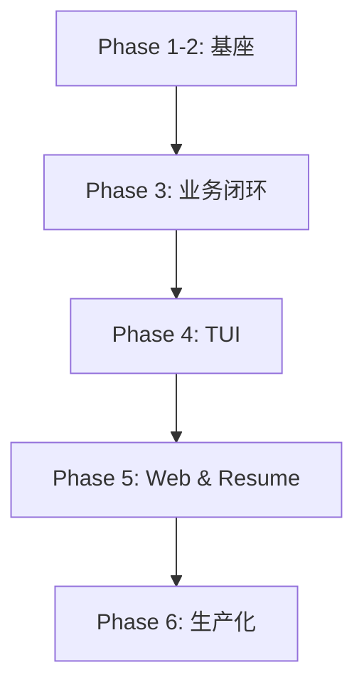

# JobClaw 开发计划 (Master Plan)

> **版本**: 0.3.x  
> **最近更新**: 2026-03-10  
> **当前状态**: Phase 1–5 已集成；进入 Phase 6（生产化优化）与 Backlog 消化阶段。

---

## 1. 里程碑与范围

### Phase 1–2（已完成）：基础设施与 Agent 基座
- Workspace 目录约束、文件锁、基础文件工具
- Tool-Driven Agent Loop + Context 压缩

### Phase 3（已完成）：核心业务闭环
- MainAgent（搜索/调度）+ DeliveryAgent（投递）
- `upsert_job` 作为唯一 jobs.md 写入口

### Phase 4（已完成）：TUI 与鲁棒性
- Blessed TUI，基础日志与 jobs 监控

### Phase 5（已完成）：Web Dashboard 与 Resume Mastery
- WebSocket 事件流：`agent:state` / `agent:log`
- HITL（人工干预）弹窗链路
- 简历生成：Typst 工具链集成

### Phase 6（进行中）：生产特性优化
- 自动化容错、性能优化、深度 Session 管理

---

## 2. 阶段依赖图

---

## 3. 关键架构约束（必须遵守）

1. **配置扁平化**：统一使用 `workspace/config.json` 顶层字段，不引入嵌套对象。
2. **写入一致性**：严禁绕过 `upsert_job` 直接写 `jobs.md`。
3. **单文件体积**：尽量保持单文件 < 500 行；超过则拆分到 util/模块。
4. **环境感知**：涉及 Shell/编译/外部依赖时必须先做检测与可恢复引导。

---

## 4. V0.2.0 Review（整合结论）

### 已完成项（摘要）
- BaseAgent 流式解析与状态转换相关回归用例修复并通过。
- ContextCompressor 的 system 保留策略验证通过。
- DeliveryAgent 已增强：支持基于 `upsert_job` 结果发出更准确的投递状态通知。
- Cron 已增强：`digest` 才强制 SMTP 校验；`search` 可无 SMTP 运行。

### 发布前仍需复核
- [ ] Cron 两种模式（`search`/`digest`）在无 SMTP 与有 SMTP 环境下行为符合预期。
- [ ] Web Dashboard 联动：`agent:state`、`agent:log`、HITL、Chat 指令投递。
- [ ] `workspace/config.json.example` 补齐并同步最新配置项。
- [ ] `README.md` 与 `SPEC.md` 同步最新行为（Summary Model 默认值、Cron 模式差异等）。

---

## 5. Backlog（同步自 todo.md）

> 本节用于承接 `todo.md` 的条目，作为 Phase 6 的实际执行清单。完成后请同时更新本节与 `todo.md`。

### P1：性能与稳定性
- [ ] TUI 渲染性能：引入内容哈希校验，减少 `jobs.md` 无效解析。
- [ ] 自动化重试框架：在 BaseAgent 层面实现工具调用的指数退避重试。
- [ ] Session 智能管理：定期清理冗余的消息历史，保持 Session 紧凑。
- [ ] 通道限流：针对邮件通知增加发送频率保护逻辑。
- [ ] 异步化消息流：梳理并统一 UI/Channel/EventBus 的“流式输出”与“最终态”处理。

### P2：产品能力
- [ ] 模拟面试：根据目标岗位信息进行模拟面试。
- [ ] 简历评价 + 修改建议：对生成的简历给出可执行的改进点与迭代流程。

---

## 6. Web Dashboard（维护要点）

- 保持 `agent:log` 字段协议稳定；如需演进，优先做向后兼容（新增字段而非改名）。
- 保持 Chat 入口（`POST /api/chat`）为“触发任务”的轻量接口，执行过程统一走 WebSocket 事件流展示。
