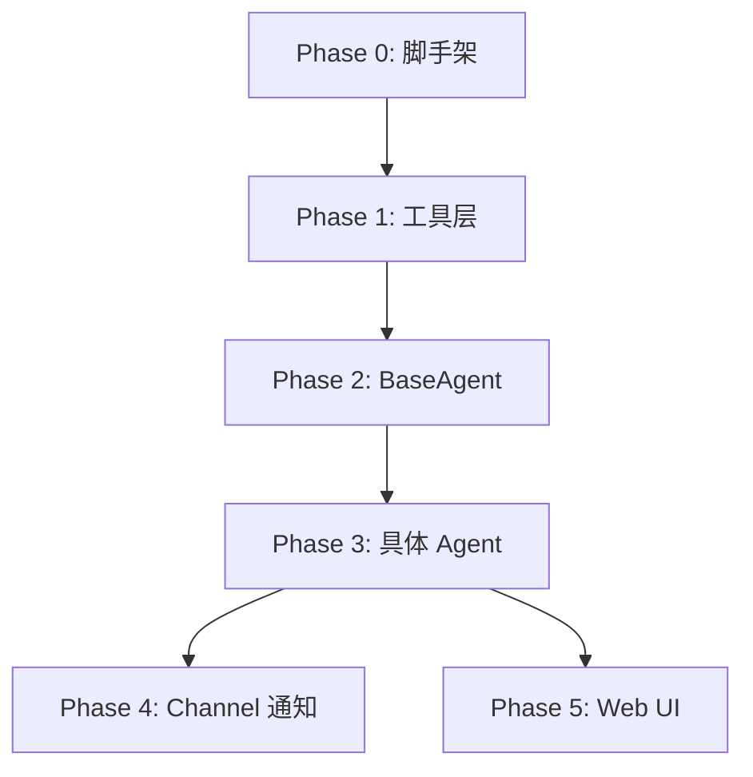

# 开发计划

> 基于 SPEC v0.1.0 与 agent-design.md (现代版)
> 更新日期: 2026-03-07

本文档是开发计划的总览。详细的任务清单和实现细节已下沉到各阶段目录的 `readme.md` 中。

## 阶段概览

- [**Phase 0：项目脚手架**](phase0/readme.md) - 环境搭建与目录结构初始化
- [**Phase 1：类型定义与工具层**](phase1/readme.md) - 核心类型与文件/锁工具实现
- [**Phase 2：BaseAgent**](phase2/readme.md) - 现代 Tool-Driven 循环与上下文管理
- [**Phase 3：具体 Agent 实现**](phase3/readme.md) - Main/Search/Delivery Agent 业务逻辑
- [**Phase 4：Channel 通知**](phase4/readme.md) - 邮件通知模块集成
- [**Phase 5：Web UI**](phase5/readme.md) - 可视化看板与事件实时推送

## 阶段依赖关系

