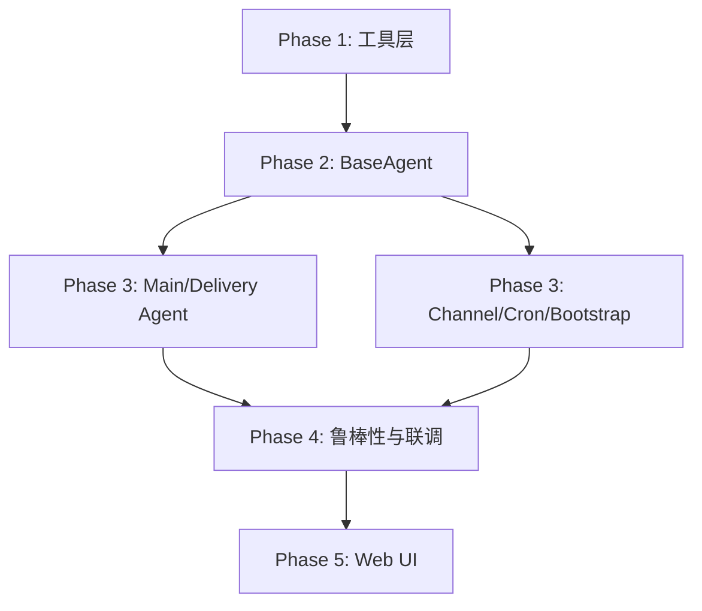

# JobClaw 核心开发路线图 (Master Plan)

> **版本**: 0.2.0 (已同步 SPEC v0.1.0)  
> **更新日期**: 2026-03-07  
> **指导原则**: 遵循两 Agent 架构 (Main/Delivery)，以文件锁为共享中心，以 Channel 为外部出口。

---

## 1. 里程碑阶段划定

### [Phase 1: 基础设施与工具层 (已完成)](/docs/dev/phase1/readme.md)
- **核心**: 建立 Workspace 结构，实现 `read_file`, `write_file`, `lock_file` 等 6 个核心工具。
- **状态**: 验证通过。

### [Phase 2: BaseAgent 核心机制 (已完成)](/docs/dev/phase2/readme.md)
- **核心**: 实现 Tool-Driven LLM 循环，引入 **ContextCompressor** (上下文压缩) 和 **runEphemeral** (无状态执行) 机制。
- **状态**: 架构基石已建立。

### [Phase 3: 核心功能与运行环境 (当前阶段)](/docs/dev/phase3/readme.md)
- **核心**: 实现 **MainAgent** (交互+搜索) 与 **DeliveryAgent** (Ephemeral 投递)。
- **配套**: 实现 **upsert_job** 专用工具，封装锁与通知逻辑；实现 **Channel**、**Bootstrap** 和 **CronJob**。
- **交付**: 系统能够初步“跑通”搜索、投递及外部触发。

### [Phase 4: TUI 终端仪表盘与鲁棒性 (下一步)](/docs/dev/phase4/readme.md)
- **核心**: 实现基于 `blessed` 的 TUI，实时监控发现进度与投递快照。
- **任务**: 修复正则容错、表单填充鲁棒性、处理验证码拦截与登录阻断。
- **交付**: 一个具备“上帝视角”的终端交互界面，用户可直观看到 Agent 的工作状态。

### [Phase 5: Web UI 监控看板 (远期)](/docs/dev/phase5/readme.md)
- **核心**: 提供可视化 Dashboard，实时展示 `jobs.md` 的状态变化。
- **目标**: 提供交互式的 `targets.md` 和 `userinfo.md` 编辑器。

---

## 2. 阶段依赖图

---

## 3. 关键架构约束 (必须严格遵守)

1.  **两 Agent 限制**: 只有 `MainAgent` (持久化 Session) 和 `DeliveryAgent` (Ephemeral 运行) 两个 Agent 类型。
2.  **MCP 唯一性**: 两个 Agent 必须通过构造函数注入同一个 `mcpClient` (Playwright 实例)，且执行必须串行。
3.  **SOP 唯一源**: 所有的业务操作逻辑 (搜索去重/投递流程) 必须定义在 `jobclaw-skills.md` 中，严禁将具体业务步骤硬编码在 `systemPrompt` 或代码逻辑中。
4.  **无状态 Cron**: `cron.ts` 拉起的 `MainAgent` 必须运行在 Ephemeral 模式，严禁读写交互模式的 `session.json`。
