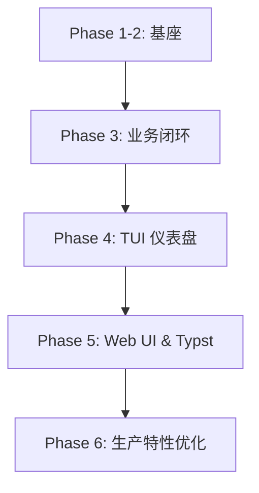

# JobClaw 核心开发路线图 (Master Plan)

> **版本**: 0.3.0  
> **更新日期**: 2026-03-08  
> **状态**: Phase 5 已全量集成。

---

## 1. 里程碑阶段执行情况

### [Phase 1-2: 基础设施与 Agent 基座 (已完成)](/docs/dev/phase1/readme.md)
- **核心**: 建立 Workspace，实现文件锁与路径安全，建立 Tool-Driven LLM 循环与 Context 压缩。
- **交付**: 可扩展的 Agent 运行底座。

### [Phase 3: 核心业务逻辑 (已完成)](/docs/dev/phase3/readme.md)
- **核心**: 实现 MainAgent (搜索) 与 DeliveryAgent (投递) 的协作流程。引入 `upsert_job` 专用工具。
- **交付**: 完整的职位发现与投递自动化链路。

### [Phase 4: TUI 仪表盘与鲁棒性 (已完成)](/docs/dev/phase4/readme.md)
- **核心**: 基于 `blessed` 的实时终端监控界面。实现宽容解析与环境预检。
- **交付**: 可视化的本地交互环境。

### [Phase 5: Web Dashboard 与 Resume Mastery (已完成)](/docs/dev/phase5/readme.md)
- **核心**: 
    - 搭建 Hono Web 服务，通过 WebSocket 实时推送 Agent 活动流。
    - 实现 **HITL (人工干预)** 弹窗，打通 Web 到 Agent 的反馈回路。
    - 集成 **Typst 简历工具链**，支持智能简历生成与环境自动引导。
- **交付**: 现代化的 Web 监控看板与生产级简历管理功能。

### [Phase 6: 高级生产特性 (计划中)](/docs/dev/phase6/readme.md)
- **核心**: 自动化容错、性能优化、深度 Session 管理。
- **任务**: 
    - 在 BaseAgent 层面实现工具调用的**指数退避重试**框架。
    - 实现基于内容哈希的 TUI 渲染优化，减少冗余 IO。
    - 增加 **Session 智能修剪**，自动清理已完成任务的原始日志。
    - 引入 Channel 通道限流保护。

---

## 2. 阶段依赖图

---

## 3. 关键架构约束

1.  **架构扁平化**: 配置系统统一采用 `config.json` 扁平格式，不再使用嵌套对象。
2.  **文件一致性**: 严禁在代码中直接使用 `fs` 写入 `jobs.md`，必须通过 `upsert_job` 工具进行原子化操作。
3.  **单文件体积**: 严格遵守单文件不超过 500 行规范，逻辑应拆分至 `utils` 或辅助模块。
4.  **环境感知**: 所有系统级操作（Shell/编译）必须包含环境检测与自愈引导。
